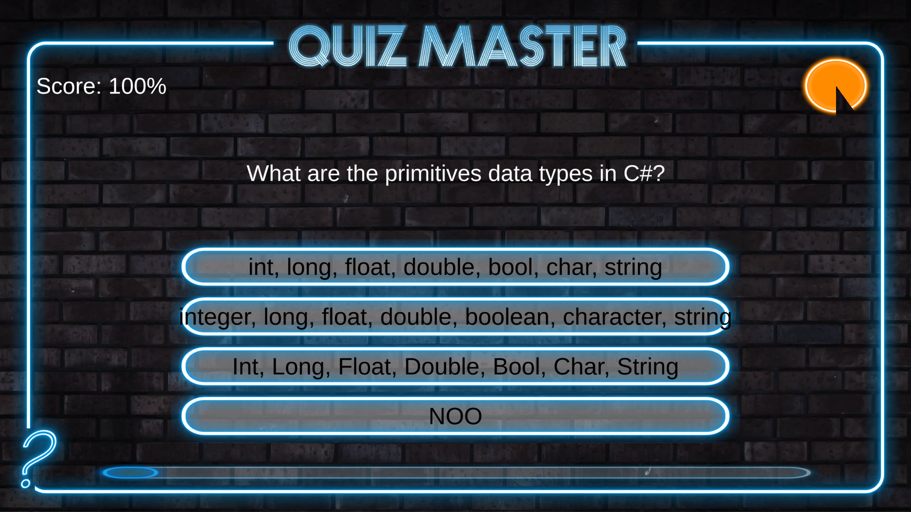
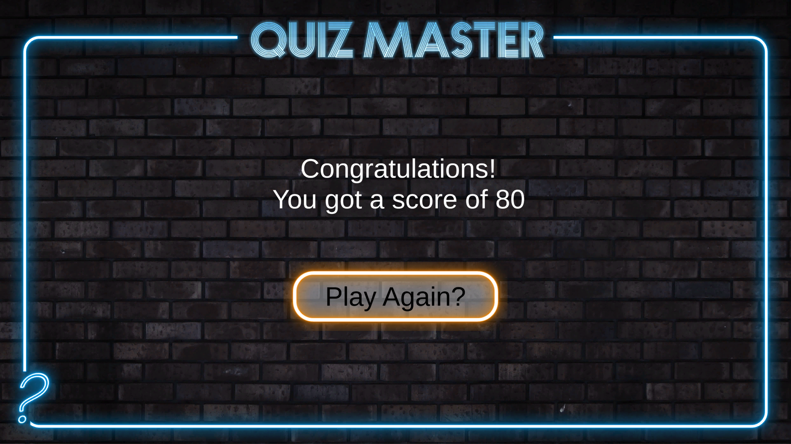

<!-- GAME PROJECT TITLE -->
# QuizMaster---Game
Game created for study purposes by Matheus Soares Martins, and it is a simple quiz game where you have to answear 10 questions about C#, having a limited number of seconds
to answear the questions and to check if you scored correctly after answearing. 
After asnwearing all the questions, you will proceed to the end screen where you will be shown your final score in the game, and having a button that allow you to try
again if you want.
 

This game was made to be played by one player, and all you need is the mouse to play this game.(And some keys for the shortcuts)
 

Game Controls 
- Player controls: 
Mouse - Choose the answear for a question 

- Other controls: 
Esc - Closes the game 
F11 - Toggle between fullscreen and windowed mode. 
******************************************************************************

 

<!-- GAME PROJECT IMAGES -->
# Screenshots

<!-- GAME PROJECT BUILDS -->
# Game download 
## Windows: https://mega.nz/folder/VU8S0IpI#cb5JdAc_6FGbjkdVrcuTgw
## Mac: https://mega.nz/folder/YUlVGALD#X0mjLahKGim-CVw_HcMajQ
## Linux:  https://mega.nz/folder/hJkj3b4I#8--Gq_P-jYUt4KO9e9Bs-A